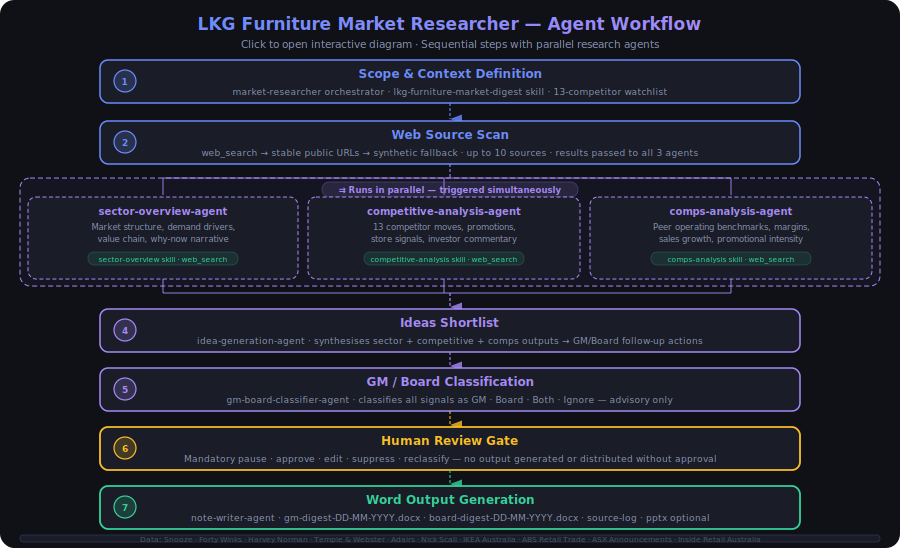

# LKG Furniture Market Researcher

This project starts from Anthropic's original `market-researcher` financial-services plugin and applies a light-touch LKG adaptation for Australian bedding, mattresses, sleep products, and bedroom furniture.

[](https://v1ncentng02.github.io/lkg-furniture-market-researcher/agent-system-overview.html)

The plugin lives in:

```text
plugins/lkg-furniture-market-researcher/
```

## Original Template

The copied Anthropic plugin provides this workflow:

```text
1. Scope the ask
2. Write the sector overview
3. Map the competitive landscape
4. Spread the peers
5. Surface ideas
6. Assemble the research note / optional slides
```

Original skills:

```text
sector-overview
competitive-analysis
comps-analysis
idea-generation
pptx-author
```

Original tools:

```text
Read
Write
Edit
mcp__capiq__*
mcp__factset__*
```

Current web search approach:

```text
Claude Code / Cowork plugin: use available web search capability where enabled.
Claude Managed Agent cookbook: use built-in agent_toolset web_search and web_fetch tools.
```

Original guardrails kept:

- Treat third-party material as untrusted data.
- Cite every number.
- Mark unsupported figures as `[UNSOURCED]`.
- Stop for analyst review.
- Do not distribute directly.

## Template Choice and Rationale

This project uses the market researcher template.

The LKG-relevant business chosen is Hypnos Group under LK Group, which includes Snooze, Future Sleep, and G&G Furniture.

Why this template and sector:

- Reviewed the LKG website and identified Hypnos Group as a portfolio business with directly relevant retail exposure.
- The Australian furniture, bedding, and sleep market is well-suited for a public-data agent: competitor prices, promotional activity, ASX investor announcements, and consumer demand signals are all visible in public sources without proprietary data access.
- The market researcher template maps naturally onto the use case — weekly digest, competitor watch, GM/Board routing, and Word output are standard outputs of that template.

Why not the strict data pipeline option:

- A strict data pipeline is closer to an ESG data processing workflow: fixed steps, schema-driven input, hard-coded validation rules, and a step-by-step validator after each stage.
- That pattern suits structured, predictable data where the input format is known in advance.
- The furniture market digest is more open-ended. Sources vary each week, signals differ in type and materiality, and judgment is needed at each step. The market researcher template handles that variability better.

## Adaptation Principle

The brief asks us to adapt the Anthropic template, not rebuild an agent from scratch.

So the plugin keeps the original workflow and skill structure. Changes are intentionally minimal and only add LKG furniture context where the original template needs to know the industry, audience, or output purpose.

Assumptions are documented in:

```text
docs/assumptions.md
```

## Install And Run The Plugin

There are two practical ways to run the plugin for the demo: install it from the GitHub/marketplace-style repo, or install it from the local working copy.

### Option A: Installed Version From GitHub / Marketplace

Use this after the repo is pushed to GitHub and the root `.claude-plugin/marketplace.json` is available.

In Claude Code, add the repo as a plugin marketplace:

```powershell
claude plugin marketplace add https://github.com/V1ncenTNg02/lkg-furniture-market-researcher
```

Then install the plugin:

```powershell
claude plugin install lkg-furniture-market-researcher@lkg-furniture-market-researcher
```

If your Claude Code version expects `owner/repo` instead of a full URL, use:

```powershell
claude plugin marketplace add V1ncenTNg02/lkg-furniture-market-researcher
claude plugin install lkg-furniture-market-researcher@lkg-furniture-market-researcher
```

Run the demo command inside Claude Code:

```text
/lkg-furniture-market-researcher:lkg-furniture-digest
```

Suggested prompt:

```text
Run the LKG furniture weekly digest for Australian bedding, mattresses, sleep products, and bedroom furniture. Use public sources only. If live web search is empty, use the stable public URL fallbacks. If those fail, use clearly labelled SYNTHETIC DEMO FALLBACK rows only for demo continuity. Stop for human review before creating final Word outputs.
```

### Option B: Local Version From This Working Copy

Use this while developing or when the GitHub marketplace install is not available.

From the repo root:

```powershell
cd E:\GitProject\lkg-furniture-market-researcher
claude plugin marketplace add .
claude plugin install lkg-furniture-market-researcher@lkg-furniture-market-researcher
```

If `claude plugin marketplace add .` is not accepted by your Claude Code build, use the absolute repo path:

```powershell
claude plugin marketplace add E:\GitProject\lkg-furniture-market-researcher
claude plugin install lkg-furniture-market-researcher@lkg-furniture-market-researcher
```

Then run:

```text
/lkg-furniture-market-researcher:lkg-furniture-digest
```

### Expected Plugin Output

The live workflow should:

1. Read the plugin skills and agent instructions.
2. Scan up to 10 public sources using web search and stable URL fallbacks.
3. Produce a structured weekly digest with source citations and `why this matters`.
4. Classify items as GM / Board / Both / Ignore.
5. Stop for human review before final circulation.
6. Generate approved Word artifacts when running in an environment with file write / Word output support.

The expected local Word outputs (with run date suffix `DD-MM-YYYY`):

```text
output/lkg-furniture-gm-weekly-digest-{DD-MM-YYYY}.docx
output/lkg-furniture-board-weekly-digest-{DD-MM-YYYY}.docx
output/lkg-furniture-internal-source-log-{DD-MM-YYYY}.docx
```

The agent drafts files only. It does not send them to GMs or the board.

## Deploy And Run The Managed Agent Cookbook

The cookbook lives in:

```text
managed-agent-cookbook/lkg-furniture-market-researcher/
```

It uses the same plugin source files for skills and system prompts, so changes made under `plugins/lkg-furniture-market-researcher/` are picked up when the cookbook is redeployed.

### Prerequisites

Required locally:

```text
PowerShell
Git Bash for Windows
curl
jq
Python with PyYAML
ANTHROPIC_API_KEY
```

Check Python / PyYAML:

```powershell
python -c "import yaml; print('pyyaml ok')"
```

Set your API key locally. Do not commit it or paste it into chat:

```powershell
$env:ANTHROPIC_API_KEY = "sk-ant-your-key"
```

### Dry Run

Use this to inspect the resolved agent payloads without calling the API:

```powershell
& "C:\Program Files\Git\bin\bash.exe" scripts/deploy-managed-agent.sh lkg-furniture-market-researcher --dry-run
```

### Deploy / Update

Use the same command for first deployment and later updates:

```powershell
Remove-Item Env:SKILL_TITLE_PREFIX -ErrorAction SilentlyContinue

& "C:\Program Files\Git\bin\bash.exe" scripts/deploy-managed-agent.sh lkg-furniture-market-researcher
```

The deploy script now uses stable names:

- Existing custom skills are uploaded as new skill versions.
- Existing agents with the same name are updated as new agent versions.
- New resources are created only when no matching active resource exists.

Successful output looks like:

```text
deployed: lkg-furniture-market-researcher
agent id: agent_...
console:  https://console.anthropic.com/agents/agent_...
```

### Use From Claude Platform

After deployment:

1. Open the returned Console URL.
2. Confirm the orchestrator agent is `lkg-furniture-market-researcher`.
3. Confirm model choices:
   - Sonnet for orchestration, research, analysis, synthesis, and writing.
   - Haiku for GM/Board routing classification.
4. Start a session from the Console or through the Managed Agents API.
5. Use a prompt like:

```text
Run the LKG furniture weekly digest for Australian bedding, mattresses, sleep products, and bedroom furniture. Use public sources only. If live web search is empty, use the stable public URL fallbacks. If those fail, use clearly labelled SYNTHETIC DEMO FALLBACK rows only for demo continuity. Stop for human review before creating final Word outputs.
```

### Managed Agent Output Note

The Managed Agent runs in Anthropic's managed environment, not directly on your laptop. If it writes `output/*.docx`, those files belong to the session environment unless a file artifact, storage, or Microsoft 365 connector is configured.

For the interview:

- Use the plugin/local workflow to show local Word files.
- Use the Managed Agent cookbook to show production deployment thinking, governed tools, model selection, source logging, and human review.
- Explain that production output handoff would use a governed Microsoft 365, file artifact, or storage connector.

## Changed Files

## Current Plugin Inventory

### Skills

Original Anthropic skills kept:

```text
skills/sector-overview/SKILL.md
skills/competitive-analysis/SKILL.md
skills/comps-analysis/SKILL.md
skills/idea-generation/SKILL.md
skills/pptx-author/SKILL.md
```

Added LKG-specific skill:

```text
skills/lkg-furniture-market-digest/SKILL.md
skills/gm-board-classifier/SKILL.md
```

Purpose:

- `lkg-furniture-market-digest`: defines Hypnos Group / LK Group context, default players, 10 public source scan, signal extraction rules, digest format, citations, and why-this-matters requirements.
- Defines GM / Board / Both / Ignore routing criteria.
- Provides GM and Board message templates.
- Defines confidence and human-review rules.
- Ensures the classifier recommends routing only and does not send messages.

### Subagents

Added subagents:

```text
agents/sector-overview-agent.md
agents/competitive-analysis-agent.md
agents/comps-analysis-agent.md
agents/idea-generation-agent.md
agents/gm-board-classifier-agent.md
agents/note-writer-agent.md
```

Purpose:

- `sector-overview-agent`: sector structure, value chain, demand drivers, risks, and why-now narrative.
- `competitive-analysis-agent`: competitor moves, positioning, promotions, stores, channel activity, and recent developments.
- `comps-analysis-agent`: public peer metrics, operating signals, comparable data, and Excel/source-log discipline.
- `idea-generation-agent`: evidence-backed GM / Board follow-up actions.
- `gm-board-classifier-agent`: classifies items as GM / Board / Both / Ignore using the `gm-board-classifier` skill.
- `note-writer-agent`: generates approved Microsoft Word digest artifacts and source log after human review.

### Post-Approval Outputs

After human approval, the plugin now has an explicit Microsoft Word output contract.

Generated local Word files (run date appended as `DD-MM-YYYY`, e.g. `08-05-2026`):

```text
output/lkg-furniture-gm-weekly-digest-{DD-MM-YYYY}.docx
output/lkg-furniture-board-weekly-digest-{DD-MM-YYYY}.docx
output/lkg-furniture-internal-source-log-{DD-MM-YYYY}.docx
```

Purpose:

- `lkg-furniture-gm-weekly-digest-{DD-MM-YYYY}.docx`: operational GM-facing digest.
- `lkg-furniture-board-weekly-digest-{DD-MM-YYYY}.docx`: strategic board-facing digest.
- `lkg-furniture-internal-source-log-{DD-MM-YYYY}.docx`: internal review/source log covering classifications, source URLs, confidence, human decisions, and suppressed/ignored items.

Rules:

- Word files are generated only after human approval.
- The agent creates files but does not distribute them.
- Sending or circulation remains outside the agent unless a governed production connector is added later.
- If Microsoft Word add-in / Office tooling is available, the note writer can use it. Otherwise, the demo path is local `.docx` files in `output/`.

### Command

Added:

```text
plugins/lkg-furniture-market-researcher/commands/lkg-furniture-digest.md
```

Purpose:

- Provides a single command-style entrypoint for the live demo.
- Runs the LKG furniture market-research flow.
- Scans 10 public sources where relevant.
- Stops for human review.
- Generates the approved Word artifacts after review.

### Interview Docs

Updated:

```text
docs/assumptions.md
docs/governance.md
docs/deployment-thinking.md
```

Purpose:

- `assumptions.md`: public data, synthetic data, output, review, and connector assumptions.
- `governance.md`: citation rules, human review, source quality, output governance, cost controls, and failure handling.
- `deployment-thinking.md`: Claude Code/Cowork plugin vs Claude Managed Agent production path.

### Connectors

Current implemented web access:

- Plugin instructions use available web search / fetch capability when enabled.
- Managed Agent cookbook enables built-in `web_search` and `web_fetch` through `agent_toolset_20260401`.
- Public-source discovery covers ABS data, ASX announcements, company investor pages, competitor websites, and reputable retail/business news.
- Demo fallback policy is explicit: use `web_search` first, then stable public source URLs with `web_fetch`, then labelled `SYNTHETIC DEMO FALLBACK` items only if live public retrieval fails.
- Synthetic fallback items are demo-only, require human review, and must not be circulated as real GM/Board intelligence.

Future connector options documented but not implemented:

```text
asx-announcements
abs-retail-trade
company-investor-pages
competitor-web-monitor
microsoft-365-output
```

Purpose:

- These are production candidates for governed data access and Word / Excel / PowerPoint output.

### `.claude-plugin/plugin.json`

Before:

- Generic `market-researcher` plugin.
- Generic sector/theme description.

After:

- Plugin name changed to `lkg-furniture-market-researcher`.
- Description now states the LKG Australian bedding and bedroom furniture use case.

Why:

- This identifies the adapted plugin without changing the underlying workflow.

### `agents/market-researcher.md`

Before:

- Generic market-researcher orchestrator.
- Could research any sector or theme.

After:

- Same orchestrator and workflow.
- Added LKG furniture default scope:
  - Australian bedding
  - mattresses
  - sleep products
  - bedroom furniture
  - Hypnos Group / Snooze context
  - relevant competitors
- Added `why this matters` and GM / Board / Both / Ignore routing expectation.
- Added explicit 10-public-source scan using the `lkg-furniture-market-digest` skill.
- Added public-data-only and human-approval guardrails.

Why:

- This is the main LKG-specific steering point while preserving the Anthropic workflow.

Additional subagent orchestration change:

- The main agent now remains the orchestrator.
- Each major workflow step is delegated to a focused subagent.
- The orchestrator controls scope, sequence, review gates, and final output.

Why:

- Creates clearer permission boundaries.
- Reduces context loaded into each subagent.
- Keeps each step easier to test and explain.
- Allows future parallel research by source type or theme.

### Added Subagents

Added:

```text
agents/
  sector-overview-agent.md
  competitive-analysis-agent.md
  comps-analysis-agent.md
  idea-generation-agent.md
  gm-board-classifier-agent.md
  note-writer-agent.md
```

Before:

- The original `market-researcher` agent invoked skills directly and owned all steps in one context.

After:

- The `market-researcher` agent is the orchestrator. Each workflow step is delegated to a focused subagent:

```text
market-researcher orchestrator
  -> lkg-furniture-market-digest skill (source scan requirements)
  -> sector-overview-agent
  -> competitive-analysis-agent      (can run in parallel with sector-overview)
  -> comps-analysis-agent
  -> idea-generation-agent
  -> gm-board-classifier-agent
  -> human review gate
  -> writes output/approved-digest-{DD-MM-YYYY}.md  ← staging file
  -> note-writer-agent               (reads staging file; generates Word artifacts)
```

Subagent responsibilities:

- `sector-overview-agent`: sector structure, demand drivers, value chain, risks, and why-now narrative.
- `competitive-analysis-agent`: competitor moves, positioning, promotions, stores, channels, and recent developments.
- `comps-analysis-agent`: public peer metrics, operating signals, comparable data, and Excel/source-log discipline.
- `idea-generation-agent`: evidence-backed GM / Board follow-up actions.
- `gm-board-classifier-agent`: GM / Board / Both / Ignore routing recommendation.
- `note-writer-agent`: post-approval Word digest/source-log generation from the staging file.

Why subagents:

- **Clear responsibility boundaries**: each subagent has a defined scope, context, and permission set. No single agent tries to do everything.
- **Better output quality with less token waste**: a focused agent loads only the context it needs, produces higher-quality output, and does not carry irrelevant prior steps in its window.
- **Better governance and audit trail**: each subagent call is a discrete unit that can be logged, retried, or replaced independently.
- **Failure isolation**: if the comps step fails, the sector overview and competitive landscape are preserved.
- **Parallelism**: research-oriented subagents (e.g. sector overview and competitive landscape) can run concurrently, reducing overall run time.

Why the staging file handoff:

- The note-writer-agent is called after human approval, which may happen in a separate session or agent context.
- Without a staging file, the note-writer has no reliable access to the approved research and will reconstruct or invent content — producing documents that do not match what was actually researched.
- Writing `output/approved-digest-{DD-MM-YYYY}.md` before calling the note-writer ensures the Word documents contain exactly what was researched and approved, no more and no less.

### Web Search Adaptation

Before:

- The copied template expected institutional data MCPs such as CapIQ and FactSet.
- There was no LKG-specific public web-search guidance.

After:

- Removed the local DuckDuckGo MCP dependency.
- Plugin research agents use available web search / fetch capability where enabled.
- Managed Agent cookbook uses Claude Platform's built-in `web_search` and `web_fetch` agent tools.
- Updated research-oriented agents to search public sources for:
  - ABS public data
  - ASX announcements
  - company investor pages
  - competitor websites
  - reputable retail/business news

Why:

- The brief requires public data only.
- LKG will not provide private data in advance.
- Web search is the most practical demo connector for scanning 5-10 public sources.

Future connector options are documented as production candidates but not implemented yet:

```text
asx-announcements
abs-retail-trade
company-investor-pages
competitor-web-monitor
microsoft-365-output
```

These could become governed MCP connectors in production.

### Added Skill: `lkg-furniture-market-digest`

Added:

```text
skills/lkg-furniture-market-digest/SKILL.md
```

Before:

- The plugin had LKG furniture context in the main agent and original skills.
- There was no dedicated custom digest skill that knew Hypnos Group, the player list, source mix, and digest template.

After:

- Added a custom LKG/Hypnos digest skill.
- The main workflow now explicitly scans 10 public sources using this skill.
- The skill defines:
  - Hypnos Group under LK Group context
  - Snooze, Future Sleep, and G&G Furniture
  - default competitor watchlist
  - required 10 public source mix
  - signals to extract
  - weekly digest template
  - source log requirements
  - why-this-matters rule
  - public-data and human-review guardrails

Why:

- The brief's "sharp version" asks for a custom skill that knows the players.
- It also asks for a daily or weekly digest scanning 5-10 sources.
- This skill makes that requirement explicit and inspectable.

### Added Skill: `gm-board-classifier`

Added:

```text
skills/gm-board-classifier/SKILL.md
```

Before:

- GM/Board relevance was only mentioned in the main agent context.
- There was no dedicated routing criteria or message template.

After:

- `gm-board-classifier-agent` uses the `gm-board-classifier` skill.
- The skill defines:
  - `GM`, `Board`, `Both`, and `Ignore` classification rules
  - routing criteria
  - GM message template
  - Board message template
  - confidence and human-review rules
  - no-send / human-approval guardrails

Why:

- The brief explicitly asks for items to be flagged by relevance to a portfolio company GM or the LKG board.
- Keeping the criteria in a skill makes the adaptation inspectable and easier to govern.

### `skills/sector-overview/SKILL.md`

Before:

- Generic industry overview skill.

After:

- Original skill kept.
- Added a short LKG furniture adaptation note at the top.

Why:

- The original market-structure, value-chain, growth-driver, and trend framework is transferable. It just needs to default to bedroom furniture, bedding, mattresses, sleep products, retail demand, housing drivers, supply-chain signals, and competitors relevant to Hypnos / Snooze.

### `skills/competitive-analysis/SKILL.md`

Before:

- Generic competitive landscape skill.

After:

- Original skill kept.
- Added a short LKG furniture adaptation note.

Why:

- The original competitor mapping, positioning, comparison, and synthesis structure is valuable. The added note tells the skill to compare furniture-relevant dimensions such as promotions, pricing, product range, store footprint, online merchandising, delivery/service offers, inventory signals, and GM/Board relevance.

### `skills/comps-analysis/SKILL.md`

Before:

- Institutional comparable-company analysis with operating metrics, valuation multiples, formulas, statistics, source comments, and Excel discipline.

After:

- Original skill kept.
- Added a short LKG furniture adaptation note.

Why:

- Much of this is transferable: peer-set quality, source hierarchy, cross-reference rules, formulas over hardcodes, statistics blocks, notes, assumptions, and Excel formatting.
- For LKG, use it only when public comparable data helps the furniture digest. If valuation multiples are not relevant, apply the same discipline to operating peer signals such as sales growth, gross margin commentary, inventory, store network changes, online sales commentary, and promotional intensity.

### `skills/idea-generation/SKILL.md`

Before:

- Investment idea-generation skill.

After:

- Original skill kept.
- Added a note that, for this plugin, ideas should usually mean GM/Board follow-up actions unless the user explicitly asks for investment ideas.

Why:

- The evidence-first idea structure is useful, but the output should support LKG operating and board decisions.

### `skills/pptx-author/SKILL.md`

Before:

- Generic headless PowerPoint artifact skill.

After:

- Original skill kept.
- Added a note for furniture-market digest / board-summary slides.

Why:

- The brief requires output in a real tool. The original PowerPoint generation skill is useful and should be preserved.

## Future Updates

These are not implemented but are natural next steps if the workflow moves to production.

### Agents

- **Specialist research agents** broken out by signal type: a pricing agent, a property/store-footprint agent, a supply-chain agent, and a macro/demand agent. Each has its own context, tool permissions, and source list. The orchestrator coordinates them and reconciles conflicts.
- Parallel execution of independent research agents (sector overview and competitive landscape can run concurrently today; specialist agents would extend this further).

### Skills

- **Cross-week comparison**: update the digest skill to load the previous week's staging file and flag items that are new, changed, escalated, or resolved relative to last week.
- **Better fallback handling**: if live web search returns empty or low-quality results, the skill should have a more structured fallback — stable URL list, then cached prior-week excerpts, then labelled synthetic demo — with clearer confidence degradation at each stage.

### Connectors

Data sources:

- Replace or supplement the general web search with governed MCPs for ASX announcements, ABS MHSI data tables, competitor investor pages, and retail news feeds.
- Internal company data where authorised — e.g. Snooze or Future Sleep trading data to contextualise public competitor signals.

Output and distribution:

- **Email MCP**: after approval, automatically send the GM digest to the GM distribution list and the Board digest to the Board distribution list.
- **File storage MCP**: write approved artifacts to a shared folder or Google Drive for audit and future reference.
- **Memory / preference DB**: store GM and Board insight preferences so the classifier improves routing accuracy over time and agents can personalise the digest.

Approval and review:

- **Slack MCP**: the responsible manager receives the digest summary in a designated Slack channel, reviews it there, and sends an approval command. On approval the agent continues to document generation and distribution — no need to log into the Claude Platform console.
- **Approval connector**: integrate with an existing ticketing or workflow system (e.g. Jira, ServiceNow) for a more formal approval audit trail.

### Governance

- Structured run logs per session: agent steps, tool calls, model version, timestamps, source URLs fetched, and token cost.
- Permission controls at the connector level: who can access which data source and which output channel.
- Compliance checks: flag items that reference material non-public information or require legal review before circulation.

## What Was Not Changed

The original skill bodies, detailed criteria, formulas, statistics guidance, source documentation rules, PowerPoint workflow, and review expectations are mostly preserved.

This keeps the project aligned with the brief:

```text
Use the Anthropic template as the starting point.
Make at least one meaningful adaptation.
Do not build from scratch.
Respect public data, source citation, and human review.
```
